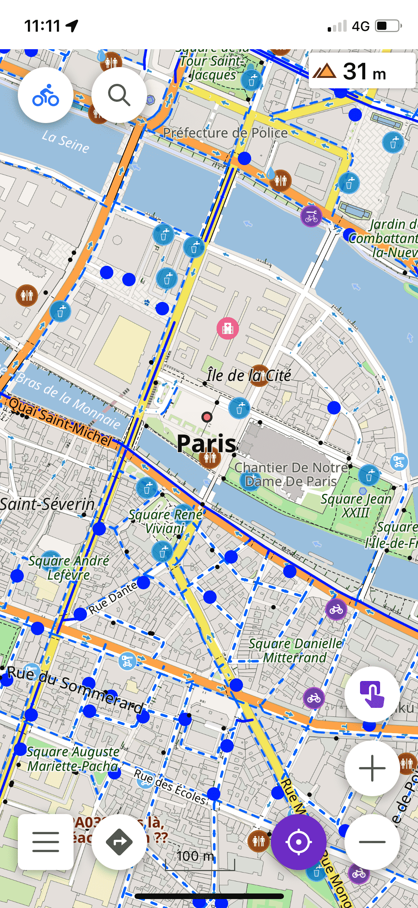
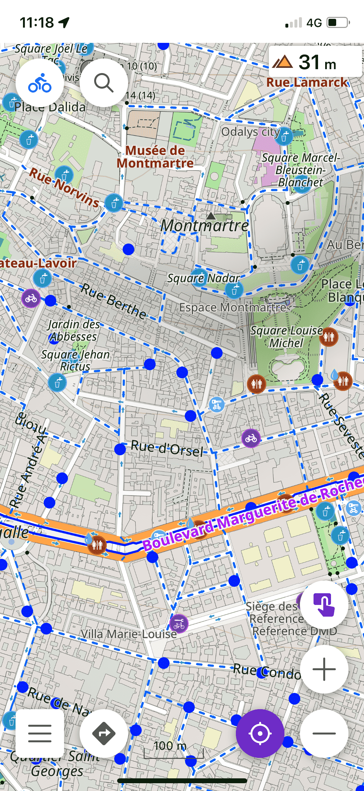
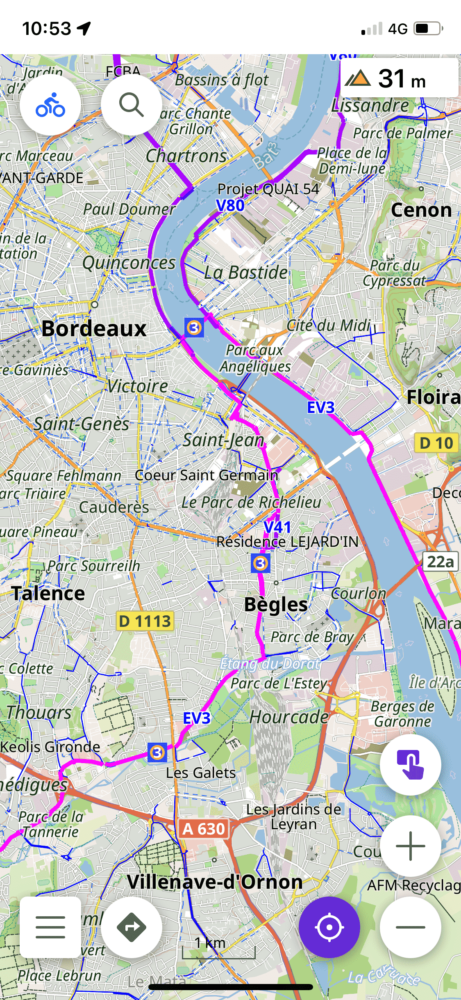
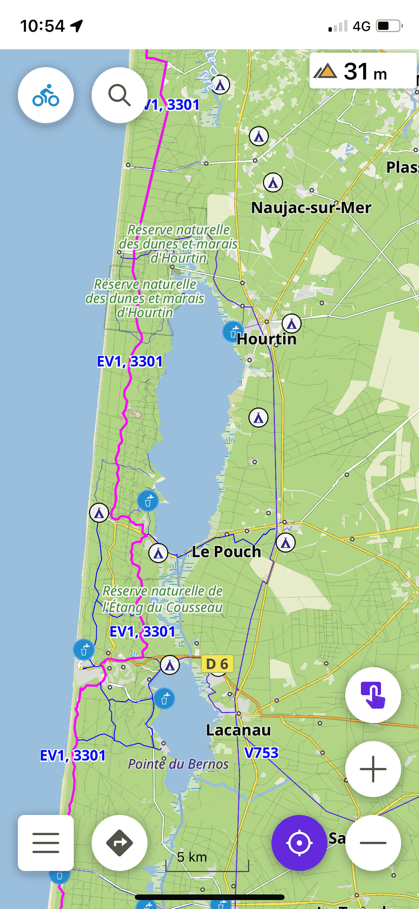
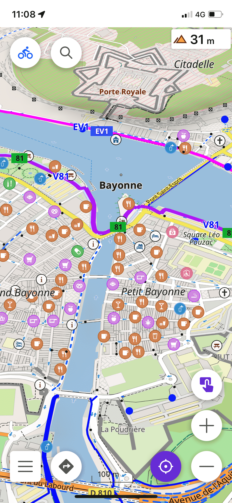

 

  

  <code>English</code>&emsp;
<a href="README_JA.md">日本語</a>&emsp;
 

# ChariRoute

A map style for OsmAnd, focused on the practice of cycling and cycloTouring in Japan 
*(Last update 17/08/2026)*  

##  Notable features over standard styles:
 

- Inspired by [CyclOSM](https://www.cyclosm.org/) :

     - More legible and visible cycle paths
     - Highlighted useful/interesting POIs
     - Opaque color for routes  

- Inspired by [Mapy.cz](https://en.mapy.cz/) :
     - Land and Water Color  

- Japan-specific :
     - The "自転車ナビマーク・ナビライン" (bicycle nav mark / nav line, `cycleway=shared_lane`) road markings, very common on Japanese roads, are highlighted with a dedicated color and dash pattern, distinct from regular cycle tracks and lanes  

- Additional setting:
     - POI for cycle tourism
     - To hide land use logos  
- Even more ; )
  

---

##  Screenshots 
### Cycling mode
|  |  |  |
| :-------------: | :-------------: | :-------------: |

### CycloTouring mode
|  |  |  |
| :-------------: | :-------------: | :-------------: |
 

---
##  Installation instructions
 

1. Open this repository's [Actions](https://github.com/LogPiyo/osmand-cycloroute-for-JP/actions) tab and pick the latest successful "Producing .osf" run
2. Download the `ChariRoute` artifact (it contains `ChariRoute.osf`)
3. Open the downloaded `.osf` file with the OsmAnd app to import the rendering style
  

---

##  Documentation
 

- [Legend (CyclOSM)](https://www.cyclosm.org/legend.html)  

---
